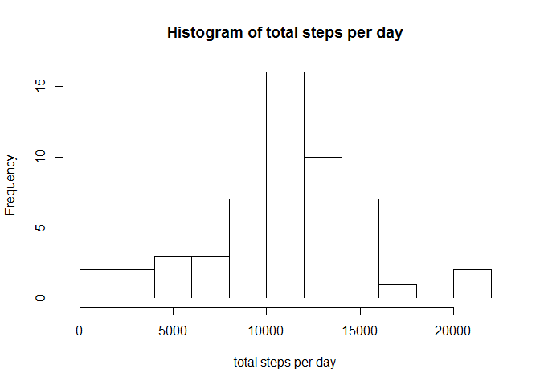
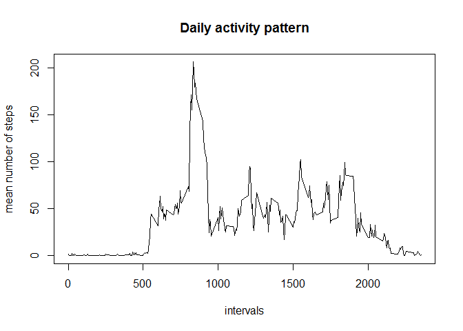
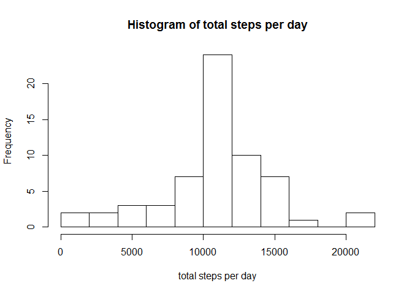
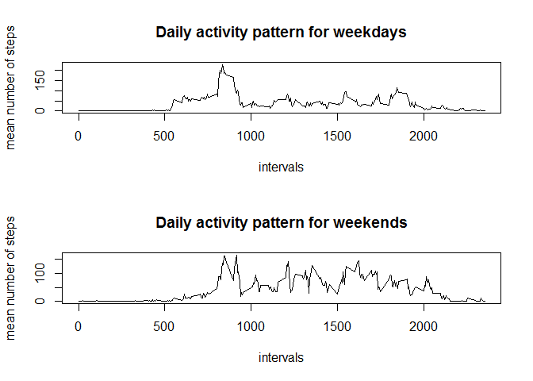

# Reproducible Research: Peer Assessment 1

## Loading and preprocessing the data

- unzip the zip file
- read in the data from the csv file


```r
unzip("./activity.zip")
activity <- read.csv("./activity.csv")
```

## What is mean total number of steps taken per day?

- remove rows with NAs from data frame
- format as numeric
- sum number of steps per day
- plot histogram of total number of steps per day
- calculate mean and median of total number of steps per day


```r
perDay <- activity[!(is.na(activity$steps)),]
perDay$steps <- as.numeric(perDay$steps)

sumPerDay <- aggregate(perDay$steps, by=list(date = perDay$date), FUN=sum)
names(sumPerDay)[2] <- "sumSteps"

hist(sumPerDay$sumSteps, breaks = 10, xlab="total steps per day",
     main="Histogram of total steps per day")
```

 

```r
mean(sumPerDay$sumSteps)
```

```
## [1] 10766.19
```

```r
median(sumPerDay$sumSteps)
```

```
## [1] 10765
```

## What is the average daily activity pattern?

- remove rows with NAs from data frame
- format as numeric
- calculate mean of steps per interval
- plot mean steps by interval
- identify interval with maximum mean steps


```r
perInterval <- activity[!(is.na(activity$steps)),]
perInterval$steps <- as.numeric(perInterval$steps)

meanPerInterval <- aggregate(perInterval$steps, by=list(interval = perInterval$interval), FUN=mean)
names(meanPerInterval)[2] <- "meanSteps"

plot(meanPerInterval$interval, meanPerInterval$meanSteps, type="l",
     xlab="intervals", ylab="mean number of steps", 
     main="Daily activity pattern")
```

 

```r
maxIndex <- which.max(meanPerInterval$meanSteps)
meanPerInterval$interval[maxIndex]
```

```
## [1] 835
```


## Imputing missing values

- calculate number of rows with NA values
- select only NA rows and fill NAs with mean of the specific interval
- clone original data frame and fill NAs with the calculated fillers
- sum number of steps per day
- plot histogram of total number of steps per day
- calculate mean and median of total number of steps per day


```r
sum(is.na(activity$steps))
```

```
## [1] 2304
```

```r
NAs <- activity[is.na(activity$steps),]
NAs <- NAs[,-1]
NAs <- merge.data.frame(NAs, meanPerInterval, by="interval", all.x = TRUE)

activity2 <- merge.data.frame(activity, NAs, by=c("interval", "date"), all.x=TRUE)
for (i in 1:nrow(activity2)) {
        if (is.na(activity2$steps[i])) activity2$steps[i] <- activity2$meanSteps[i]
        }
activity2 <- activity2[,-4]

sumPerDay2 <- aggregate(activity2$steps, by=list(date = activity2$date), FUN=sum)
names(sumPerDay2)[2] <- "sumSteps"

hist(sumPerDay2$sumSteps, breaks = 10, xlab="total steps per day",
     main="Histogram of total steps per day")
```

 

```r
mean(sumPerDay2$sumSteps)
```

```
## [1] 10766.19
```

```r
median(sumPerDay2$sumSteps)
```

```
## [1] 10766.19
```

For the selected filling strategy (fill with interval mean), there is no impact on the mean and median total number of steps.
However, the now histogram shows a much higher frequency in the central bucket (where the mean and median is).


## Are there differences in activity patterns between weekdays and weekends?

- set system language to English
- format dates
- calculate weekday and type ("weekday" or "weekend") for dates
- split dataset by type
- calculate mean of steps per interval by type
- create a plot panel with 1 column and 2 rows
- plot mean steps by interval by type in the plot panel


```r
Sys.setlocale("LC_TIME", "English")
```

```
## [1] "English_United States.1252"
```

```r
activity2$date <- as.Date(activity2$date, format = "%Y-%m-%d")
activity2$dayType <- weekdays(activity2$date, abbreviate = TRUE)
Weekend <- c('Sat', 'Sun')
activity2$dayType <- factor((activity2$dayType) %in% Weekend,
                            levels=c(TRUE, FALSE), labels=c('weekend', 'weekday'))

activity2WD <- activity2[activity2$dayType=="weekday",]
activity2WE <- activity2[activity2$dayType=="weekend",]

meanPerInterval2WD <- aggregate(activity2WD$steps, by=list(interval = activity2WD$interval), FUN=mean)
names(meanPerInterval2WD)[2] <- "meanSteps"

meanPerInterval2WE <- aggregate(activity2WE$steps, by=list(interval = activity2WE$interval), FUN=mean)
names(meanPerInterval2WE)[2] <- "meanSteps"

par(mfrow=c(2,1))
plot(meanPerInterval2WD$interval, meanPerInterval2WD$meanSteps, type="l",
     xlab="intervals", ylab="mean number of steps",
     main="Daily activity pattern for weekdays")
plot(meanPerInterval2WE$interval, meanPerInterval2WE$meanSteps, type="l",
     xlab="intervals", ylab="mean number of steps",
     main="Daily activity pattern for weekends")
```

 


